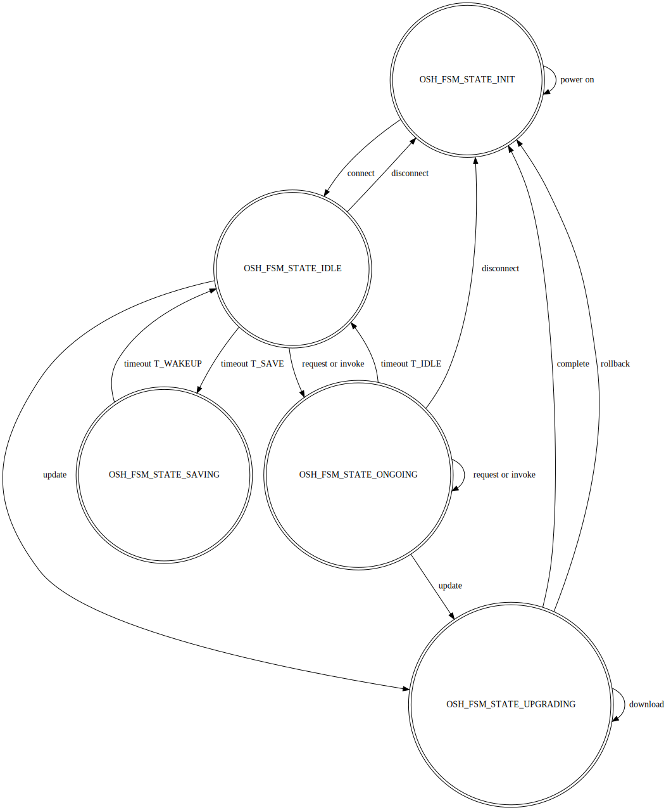

<!--
 * @Author: Zheng, Yang kevin.cn.zhengyang@gmail.com
 * @Date: 2024-04-29 23:10:16
 * @LastEditors: Zheng, Yang kevin.cn.zhengyang@gmail.com
 * @LastEditTime: 2024-05-08 23:18:41
 * @FilePath: /OpenSmartHome/components/osh_node/README.md
 * @Description: 这是默认设置,请设置`customMade`, 打开koroFileHeader查看配置 进行设置: https://github.com/OBKoro1/koro1FileHeader/wiki/%E9%85%8D%E7%BD%AE
-->
# Open Smart Home Node

the device node. using BLE or WiFi as the node transport, provide the
capability to be found and communicated with other nodes.

# Diagram

>> diagram of circuit

a RGB led to indicate the working status

# States

# Transport

Two transports can be used:
- BLE: to be implemented
- WiFi: IPV4 and UDP would be adopt when choosing WiFi

choose any one of above in menuconfig before compiling this project

# Wifi

node work as an UDP Server, which serves only one request from a client at one time.

# Proto

[COAP](https://en.wikipedia.org/wiki/Constrained_Application_Protocol) used to transfer all data exchanged among nodes.

Those data would be:

- applicational service data: to be applied in users' application
- operational service data: to be applied in supervision or maintenance of the node

<table border="1">
    <thead>
        <tr>
            <th>Octect offset</th>
            <th> </th>
            <th colspan=8 style="text-align:center">0</th>
            <th colspan=8 style="text-align:center">1</th>
            <th colspan=8 style="text-align:center">2</th>
            <th colspan=8 style="text-align:center">3</th>
        </tr>
        <tr>
            <th> </th>
            <th>Bit offset</th>
            <th>0</th>
            <th>1</th>
            <th>2</th>
            <th>3</th>
            <th>4</th>
            <th>5</th>
            <th>6</th>
            <th>7</th>
            <th>8</th>
            <th>9</th>
            <th>10</th>
            <th>11</th>
            <th>12</th>
            <th>13</th>
            <th>14</th>
            <th>15</th>
            <th>16</th>
            <th>17</th>
            <th>18</th>
            <th>19</th>
            <th>20</th>
            <th>21</th>
            <th>22</th>
            <th>23</th>
            <th>24</th>
            <th>25</th>
            <th>26</th>
            <th>27</th>
            <th>28</th>
            <th>29</th>
            <th>30</th>
            <th>31</th>
        </tr>
    </thead>
    <tbody>
        <tr>
            <td>0</td>
            <td>0</td>
            <td colspan=2 style="text-align:center">version</td>
            <td colspan=2 style="text-align:center">type</td>
            <td colspan=4 style="text-align:center">token length</td>
            <td colspan=8 style="text-align:center">request/response code</td>
            <td colspan=16 style="text-align:center">message ID</td>
        </tr>
        <tr>
            <td>4</td>
            <td>32</td>
            <td colspan=8 style="text-align:center">content type</td>
            <td colspan=24 style="text-align:center">content length</td>
        </tr>
        <tr>
            <td>8</td>
            <td>64</td>
            <td rowspan=2 colspan=32 style="text-align:center">token (0~8 bytes)</td>
        </tr>
        <tr>
            <td>12</td>
            <td>96</td>
        </tr>
        <tr>
            <td>16</td>
            <td>128</td>
            <td colspan=32 style="text-align:center">content (if available)</td>
        </tr>
    </tbody>
</table>
